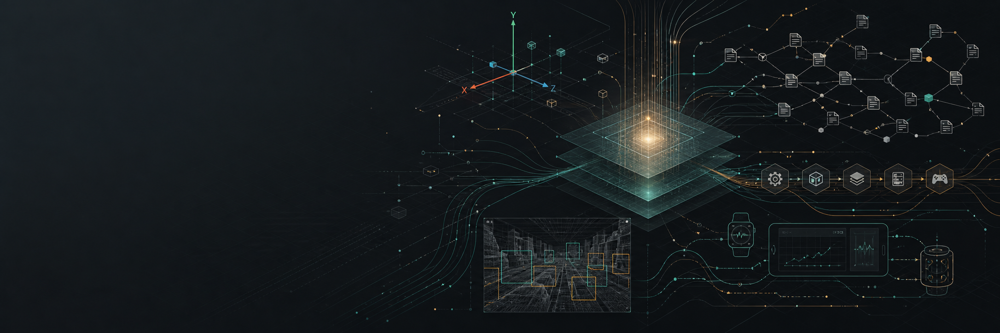

  

<h1 align="center">Yan Panaev / Feargin</h1>

  <strong>AI Tools & Platform Engineer</strong> 
  Unity Infrastructure · Agentic Workspaces · Phygital Operations · Simulation Systems

  <a href="https://github.com/ProAnima">ProAnima</a> ·
  <a href="https://proanima.net">proanima.net</a> ·
  <a href="https://nexus.proanima.net">Kodeks Nexus</a>

---

I build tools for complex systems: AI-assisted engineering workflows, Unity infrastructure, private knowledge workspaces, computer vision SDKs, and operational platforms for interactive installations.

My background crosses biology, industrial automation, Unity development, platform engineering, teaching, field expeditions, and long-form worldbuilding. The common thread is systems: understanding how messy moving parts behave, then building tools that make them observable, controllable, and easier to evolve.

## Current Focus

| Area | What I Build |
| --- | --- |
| **AI engineering** | LLM-assisted development, code review loops, RAG, MCP tools, agent workflows, context discipline, verification. |
| **Unity infrastructure** | Editor tooling, build automation, CI/CD, asset bundles, localization, test pipelines, internal devtools. |
| **Phygital operations** | Launchers, installers, self-update flows, RMM, MQTT control planes, remote control, telemetry, diagnostics. |
| **Computer vision** | Unity-first detection and tracking pipelines, ONNX / Unity Inference, model profiles, frame sources, visualization. |
| **Simulation systems** | Artificial life, genome-driven behavior, chemical environments, emergent species, worldbuilding as systems design. |

## Featured Systems

| Project | What It Shows |
| --- | --- |
| [**Abyssal Bloom**](https://github.com/Feargin/Abyssal-Bloom) | Unity ECS artificial life simulation: genome mutation, metabolism, chemical environment, selection pressure, emergent species families. |
| [**Unity Vision Tracker**](https://github.com/ProAnima/unity-vision-tracker) | Unity-first computer vision toolkit for detection, pose tracking, extensible camera sources, model profiles, and real-time visualization. |
| [**Unity Version Control MCP**](https://github.com/ProAnima/unity-version-control-mcp) | Safe MCP server for Unity Version Control / Plastic SCM with readonly defaults and guarded write tools. |
| **Kodeks Nexus** | Private AI workspace for living knowledge bases: RAG, agent tools, wiki workflows, chat sessions, file history, and desktop usage. |

## Writing Direction

I write about practical engineering where AI, tools, and production systems meet:

- AI engineering without vibe coding.
- Unity as an infrastructure platform, not only a game engine.
- Internal tools that turn release pain into repeatable operations.
- MQTT and RMM as control layers for phygital installations.
- Private AI workspaces instead of another chatbot.
- Artificial life and worldbuilding as systems-thinking laboratories.

## Principles

- Tools before heroics.
- Production workflows over demos.
- Safety and auditability before automation hype.
- Local-first and private-first where data matters.
- Clear interfaces for complex systems.
- Explain the system, not only the code.

## Short Version

I am most useful where a team has too much complexity, too many moving parts, and not enough visibility. I like turning that into tools, dashboards, agents, pipelines, and systems that people can actually operate.
